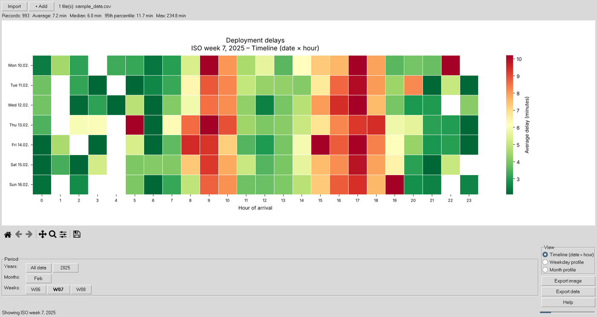
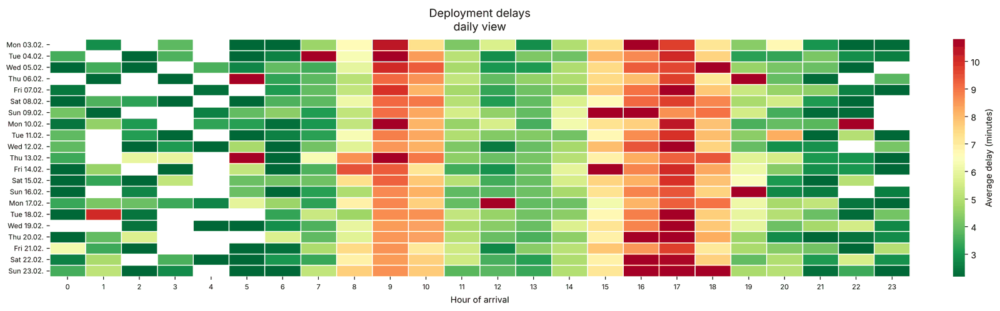

# Deployment Analyzer

Heatmaps of image deployment delays: how long does it take from the arrival of
an image to its activation in the editorial system, by date and hour of day?



The tool reads CSV or Excel exports of the editorial system, reconstructs the
arrival time of every image from the IPTC instruction field, computes the delay
until activation and shows the average delay per date (or weekday, or month)
and hour of arrival. It runs as a desktop application (Tkinter) or on the
command line.

## Installation

Python 3.10 or newer.

```bash
pip install git+https://github.com/a-schmidtlab/deployment-analysis
```

For development:

```bash
git clone https://github.com/a-schmidtlab/deployment-analysis
cd deployment-analysis
pip install -e ".[dev]"
```

On Linux, Tkinter may need a system package (`python3-tk` on Debian/Ubuntu).
A Windows build without a Python installation is described under
[Windows build](#windows-build).

## Usage

### GUI

```bash
deployment-analyzer
```

- **Import** loads one or more export files; **+ Add** merges further files
  into the current data set. Files with identical content are skipped.
- **Period** selects all data, a year, a month or an ISO week.
- **View** switches between the timeline (one row per date), the weekday
  profile and the month profile.
- **Export image** saves the heatmap as PNG, PDF or SVG; **Export data**
  saves the processed rows of the current selection as CSV or Excel.

### Command line

```bash
# statistics only
deployment-analyzer examples/sample_data.csv

# heatmap of one ISO week, weekday profile
deployment-analyzer exports/*.csv --year 2025 --week 7 -g weekly -o week7.png

# processed rows of February as CSV
deployment-analyzer exports/*.csv --year 2025 --month 2 --export-csv feb.csv
```

```text
Loaded 3,000 rows from 1 file(s); 3,000 usable, 0 dropped (0 unparseable, 0 negative, 0 above 1440 min)
Records          3,000
Average delay    6.9 min
Median delay     5.9 min
95th percentile  11.9 min
Minimum delay    0.1 min
Maximum delay    245.2 min
```

`deployment-analyzer --help` lists all options. Granularities (`-g`):
`daily` and `yearly` (one row per date), `weekly` (Monday to Sunday),
`monthly` (January to December), `hourly` (one row).



### Python

```python
from deployment_analyzer import load_files, process, pivot_delays, heatmap_figure, save_figure

data, report = process(load_files(["export.csv"]))
save_figure(heatmap_figure(pivot_delays(data, "weekly"), "weekly"), "weekly.png")
```

## Input format

Semicolon- or comma-separated CSV (UTF-8, UTF-8 with BOM or Windows-1252) or
Excel, with these columns:

| Column | Example |
|--------|---------|
| `IPTC_DE Anweisung` | `[23:51:45] *** World Rights ***` |
| `IPTC_EN Anweisung` | `[23:51:45] *** World Rights ***` |
| `Bild Upload Zeitpunkt` | `31.03.2024 23:55:07` |
| `Bild Veröffentlicht` | `Ja` |
| `Bild Aktivierungszeitpunkt` | `31.03.2024 23:55:07` |

Exports without a header row are accepted if they have exactly these five
columns in this order. Alternatively a file may contain `Bildankunft` and
`Onlinestellung` timestamps directly. How arrival time and delay are computed
is described in [docs/METHOD.md](docs/METHOD.md).

`examples/sample_data.csv` is synthetic (generated by
`tools/make_sample_data.py`). The repository contains no operational data.

## Development

```bash
ruff check . && ruff format --check . && pytest
```

The GUI test needs Tkinter and a display; it is skipped otherwise. On a
headless Linux machine run it with `xvfb-run pytest`.

```text
src/deployment_analyzer/
  loading.py      read CSV/Excel, detect encoding, delimiter, missing header, duplicates
  processing.py   arrival/activation timestamps, delay, calendar columns
  analysis.py     period filters, pivot tables, statistics
  plotting.py     heatmap figures (no pyplot, safe in the GUI)
  cli.py          command line
  gui.py          Tkinter application
  sampledata.py   synthetic test data
```

## Windows build

```powershell
.\packaging\build.ps1
```

creates `dist\DeploymentAnalyzer-<version>-win64.zip` with
`DeploymentAnalyzer.exe` (PyInstaller, one folder). Unzip and start the exe.

## License

[PolyForm Noncommercial License 1.0.0](LICENSE). Use, modification and
redistribution are free for noncommercial purposes, including personal use,
research, education and public or charitable organisations. Commercial use
requires a separate license from the author.

## Citation

See [CITATION.cff](CITATION.cff).

© 2025–2026 Axel Schmidt
