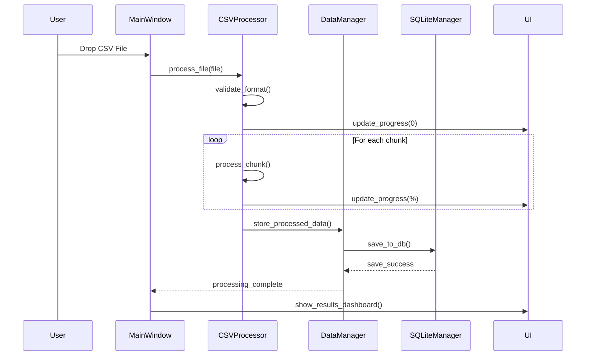
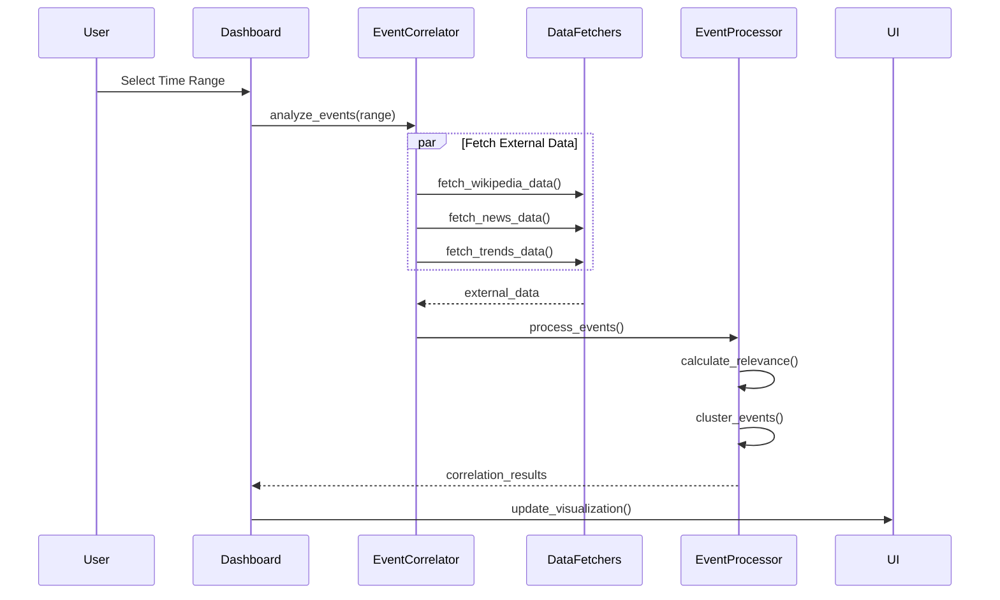
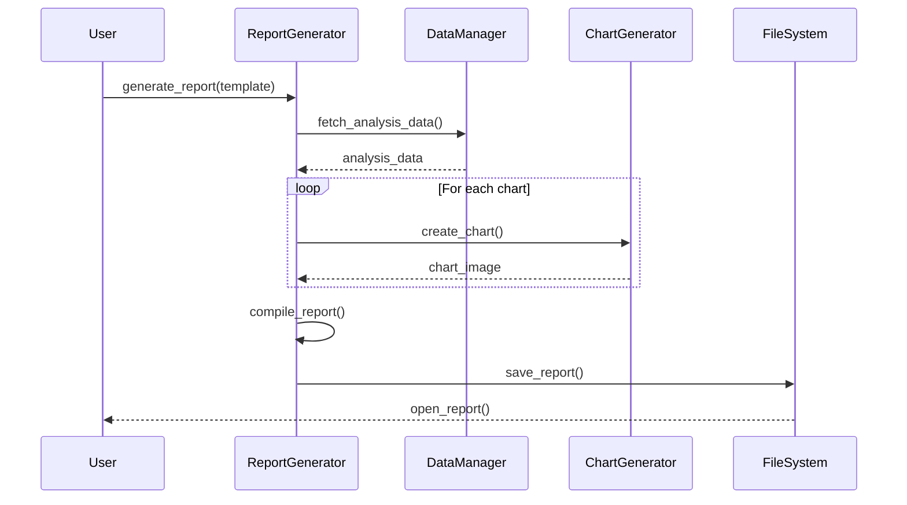
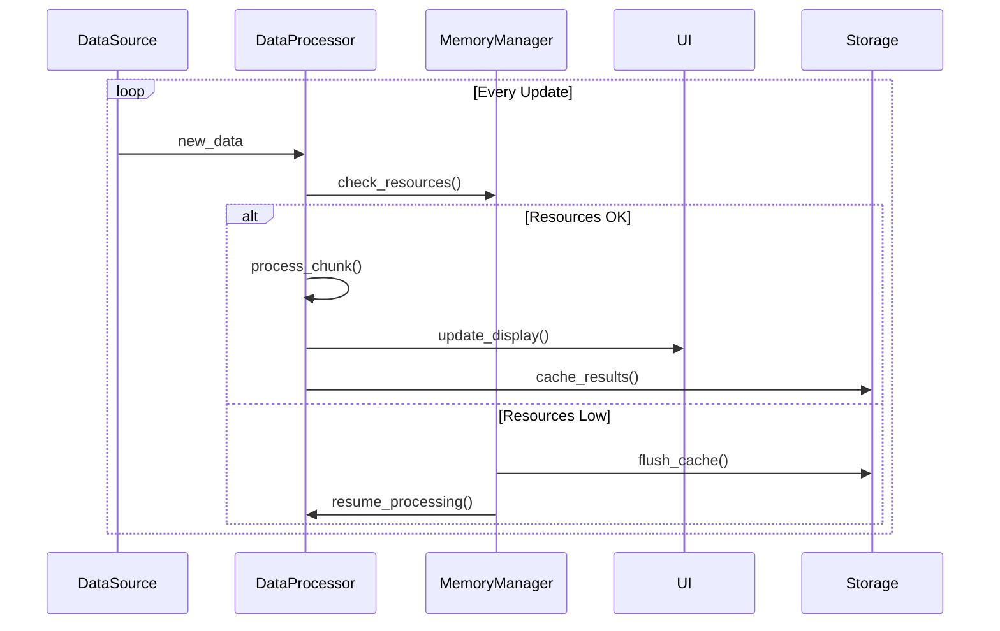
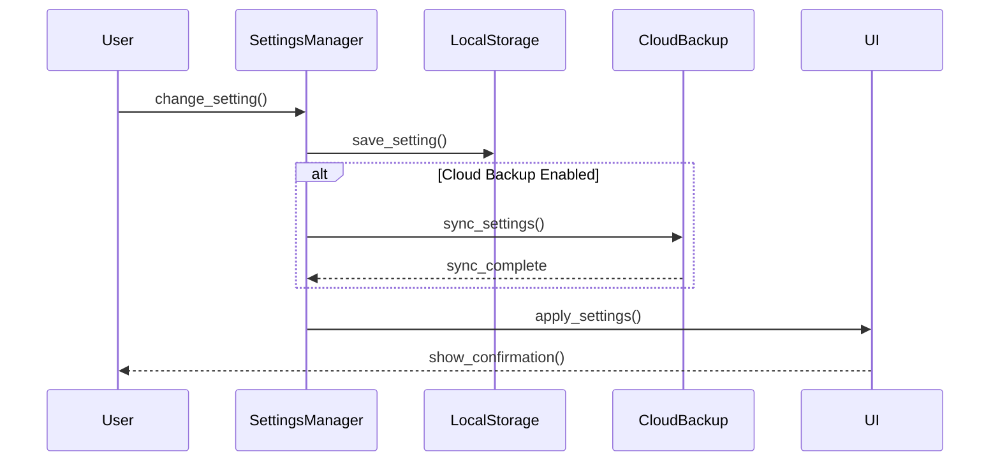
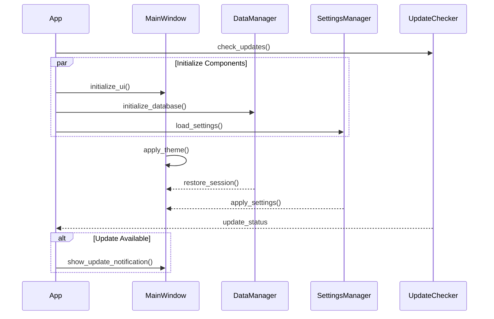

# Processing Time Analysis System - Windows Desktop Application

## Overview
Modern Windows desktop application for analyzing processing time data from image processing systems. The application provides powerful analysis tools with a clean, modern interface following Windows 11 design principles.

## Architecture

### Core System Components
1. UI Layer (PyQt6)
   ```python
   class MainWindow(QMainWindow):
       """Main application window implementing Fluent Design"""
   
   class DashboardWidget(QWidget):
       """Card-based dashboard with analysis widgets"""
   
   class ChartWidget(QWidget):
       """Base class for all chart visualizations"""
   ```

2. Data Layer
   ```python
   class DataManager:
       """Handles all data operations and caching"""
       
   class SQLiteManager:
       """Manages SQLite database operations"""
       
   class CSVProcessor:
       """Handles CSV file processing and validation"""
   ```

3. Analysis Layer
   ```python
   class TimeSeriesAnalyzer:
       """Processes time series data and detects patterns"""
       
   class EventCorrelator:
       """Implements event correlation algorithms"""
       
   class AnomalyDetector:
       """Detects and analyzes anomalies in time series"""
   ```

### Event Aggregation System
1. Data Collection
   ```python
   class EventDataFetcher:
       """Base class for event data collection"""
       
   class WikipediaFetcher(EventDataFetcher):
       """Fetches Wikipedia pageviews and metadata"""
       weight_factor = 0.4
       
   class NewsAPIFetcher(EventDataFetcher):
       """Fetches news articles and ratings"""
       weight_factors = {
           'public': 0.35,
           'established': 0.3,
           'online': 0.25,
           'other': 0.2
       }
       
   class TrendsFetcher(EventDataFetcher):
       """Fetches Google Trends data"""
       weight_factor = 0.25
   ```

2. Event Processing
   ```python
   class EventProcessor:
       """Processes and correlates events"""
       
       def calculate_relevance(self, event):
           """
           Calculates event relevance using formula:
           finalRelevance = (
               (wikipediaScore * 0.4) +
               (newsScore * sourceQualityFactor) +
               (trendScore * 0.25)
           ) * timeOnPageFactor
           """
   
   class EventClusterer:
       """Clusters similar events"""
       similarity_threshold = 0.7
       
   class RelevanceCalculator:
       """Calculates and normalizes event relevance"""
   ```

### Data Structures
1. Event Model
   ```python
   @dataclass
   class Event:
       """Represents a single event with metadata"""
       title: str
       date: datetime
       sources: List[str]
       original_relevance: float
       normalized_relevance: float
       final_relevance: float
       time_on_page: float
       source_quality: float
       cluster_id: str
   ```

2. Analysis Results
   ```python
   @dataclass
   class AnalysisResult:
       """Contains analysis results and metadata"""
       timestamp: datetime
       metrics: Dict[str, float]
       events: List[Event]
       anomalies: List[Dict]
   ```

### UI Components
1. Main Interface
   - Fluent Design implementation
   - Dark/Light theme support
   - High DPI scaling
   - Touch optimization

2. Analysis Dashboard
   - Real-time data preview
   - Interactive charts
   - Event correlation display
   - Anomaly highlighting

3. Report Generation
   - Custom templates
   - Multiple export formats
   - Batch processing

### Performance Optimizations
1. Data Processing
   ```python
   class DataOptimizer:
       """Handles data optimization strategies"""
       
       def process_in_chunks(self, data: pd.DataFrame, chunk_size: int = 1000):
           """Process large datasets in chunks"""
           
       def cache_results(self, key: str, data: Any):
           """Cache processed results"""
   ```

2. Memory Management
   ```python
   class MemoryManager:
       """Manages application memory usage"""
       
       def cleanup_old_data(self):
           """Remove old cached data"""
           
       def optimize_dataframes(self):
           """Optimize pandas DataFrame memory usage"""
   ```

### Implementation Guidelines
1. Code Structure
   ```
   src/
   ├── ui/
   │   ├── windows/
   │   ├── widgets/
   │   └── themes/
   ├── data/
   │   ├── processors/
   │   ├── database/
   │   └── cache/
   ├── analysis/
   │   ├── time_series/
   │   ├── events/
   │   └── anomalies/
   ├── utils/
   │   ├── optimization/
   │   └── helpers/
   └── tests/
   ```

2. Dependency Management
   ```toml
   [tool.poetry.dependencies]
   python = "^3.11"
   PyQt6 = "^6.5.0"
   pandas = "^2.0.0"
   numpy = "^1.24.0"
   matplotlib = "^3.7.0"
   plotly = "^5.14.0"
   sqlite3 = "*"
   ```

### Testing Strategy
1. Unit Tests
   ```python
   class TestEventAggregator(unittest.TestCase):
       """Test event aggregation functionality"""
       
   class TestDataProcessing(unittest.TestCase):
       """Test data processing and optimization"""
   ```

2. Integration Tests
   ```python
   class TestUIIntegration(unittest.TestCase):
       """Test UI integration with backend"""
       
   class TestAnalysisPipeline(unittest.TestCase):
       """Test complete analysis pipeline"""
   ```

### Development Workflow
1. Phase 1: Core (4 weeks)
   - Basic UI implementation
   - Data processing setup
   - Event aggregation system

2. Phase 2: Features (3 weeks)
   - Advanced analytics
   - Visualization system
   - Report generation

3. Phase 3: Polish (3 weeks)
   - Performance optimization
   - UI refinement
   - Testing and documentation

### Documentation
1. Code Documentation
   - Type hints
   - Docstrings
   - Example usage
   - Performance notes

2. User Documentation
   - Installation guide
   - Feature tutorials
   - Troubleshooting guide
   - API reference

## Technical Requirements

### Core System Architecture
- Framework: Python with PyQt6 for modern UI
- Data Storage: Local SQLite database
- File Support: CSV files with timestamp data
- Design System: Windows 11 Fluent Design

### User Interface Design
1. Main Window Layout
   - Clean, modern interface with Fluent Design
   - Dark/Light theme support
   - Acrylic background effects
   - Responsive window sizing
   - Multi-monitor support
   - High DPI support

2. Navigation Structure
   - Side navigation panel (collapsible)
   - Quick action toolbar
   - Recent files list
   - Tabbed interface for multiple analyses
   - Status bar with system info

3. Dashboard Components
   - Card-based widget layout
   - Interactive charts
   - Drag-and-drop file upload
   - Context menus for quick actions
   - Touch-friendly controls
   - Keyboard shortcuts

### Data Processing Module
1. CSV Processing
   - Drag-and-drop file import
   - Multi-file batch processing
   - Background processing with progress
   - Data validation and cleanup
   - Error handling with user feedback

2. Analysis Features
   - Real-time data preview
   - Automatic timestamp detection
   - Custom time range selection
   - Data filtering and sorting
   - Export to multiple formats

### Visualization Module
1. Chart Types
   - Interactive time series plots
   - Heat maps with zoom
   - Distribution plots
   - Correlation matrices
   - Custom chart themes
   - Export to PNG/PDF

2. Report Generation
   - Built-in report templates
   - Custom report designer
   - Multiple export formats
   - Batch report generation
   - Email integration

### Event Analysis System
1. Local Processing
   - Offline pattern detection
   - Statistical analysis
   - Peak detection
   - Anomaly highlighting
   - Custom event tagging

2. Optional Online Features
   - Wikipedia event correlation
   - News API integration
   - Google Trends analysis
   - Cloud backup (optional)
   - Auto-updates

### Technical Implementation
1. Core Technologies
   - Python 3.11+
   - PyQt6 for UI
   - SQLite for storage
   - Matplotlib/Plotly for charts
   - NumPy/Pandas for analysis

2. Performance Features
   - Multithreaded processing
   - Memory management
   - Disk caching
   - GPU acceleration for charts
   - Efficient data structures

### System Requirements
1. Minimum Requirements
   - Windows 10 (20H2 or later)
   - 4GB RAM
   - 1GB free disk space
   - 1080p display
   - x64 processor

2. Recommended
   - Windows 11
   - 8GB RAM
   - SSD with 5GB free
   - 1440p display or better
   - Modern multi-core processor
   - GPU with DirectX 12 support

### Installation Package
1. Distribution
   - Single .exe installer
   - Microsoft Store package (optional)
   - Silent install support
   - Portable version option

2. Components
   - Main application
   - SQLite database engine
   - Sample datasets
   - Documentation
   - Default configurations

3. Updates
   - Automatic update checks
   - Delta updates
   - Rollback capability
   - Update notifications

### User Experience Features
1. Modern UI Elements
   - Fluent Design controls
   - Animated transitions
   - Touch gestures
   - Snap layout support
   - Windows notifications

2. Productivity Features
   - Auto-save
   - Session recovery
   - Multiple window support
   - File association
   - Jump list integration

3. Accessibility
   - Screen reader support
   - Keyboard navigation
   - High contrast themes
   - Font scaling
   - Color blind modes

### Development Roadmap
1. Phase 1: Core Application (4 weeks)
   - Basic UI implementation
   - File processing
   - Database setup
   - Basic visualizations

2. Phase 2: Analysis Features (3 weeks)
   - Advanced charts
   - Statistical analysis
   - Report generation
   - Data export

3. Phase 3: Polish (3 weeks)
   - UI refinement
   - Performance optimization
   - Windows integration
   - Testing and fixes

### Testing Requirements
1. Automated Testing
   - Unit tests
   - UI automation tests
   - Performance benchmarks
   - Memory leak detection

2. Manual Testing
   - UI/UX validation
   - Multi-monitor testing
   - Different Windows versions
   - Various hardware configs

### Documentation
1. User Documentation
   - Getting started guide
   - Feature documentation
   - Tutorial videos
   - FAQ section

2. Technical Documentation
   - Architecture overview
   - API documentation
   - Database schema
   - Build instructions

## Sequence Diagrams

### 1. CSV File Processing Flow


### 2. Event Correlation Analysis


### 3. Report Generation Flow


### 4. Real-time Data Processing


### 5. User Settings Synchronization


### 6. Application Startup Sequence



